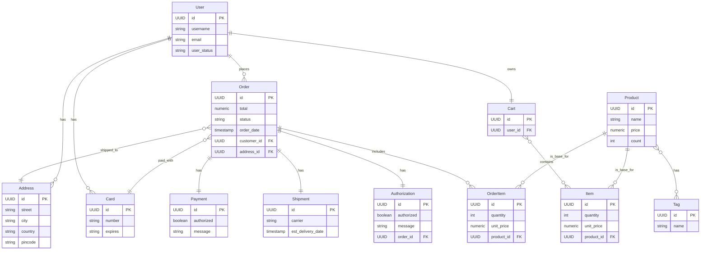

# eCommerce Project

This is a sample eCommerce application built with Spring Boot.

## Acknowledgements

This project is based on the concepts and examples from the book "[Modern API Development with Spring and Spring Boot](https://github.com/PacktPublishing/Modern-API-Development-with-Spring-and-Spring-Boot)" by Packt Publishing.

## ER 다이어그램

## Future Improvements

- **API Specification Enhancement:**
  - Add `examples` to API request and response schemas in `openapi.yaml` for better documentation and usability.
  - Define `securitySchemes` (e.g., JWT, OAuth2) in `openapi.yaml` to specify API authentication and authorization methods.

- **Code Refactoring:**
  - Refactor the `ItemRepository` to use `Optional<T>` for return types where an item may not be found, improving null safety.
  - Replace raw `DAO` patterns with Spring Data JPA repositories for more idiomatic and efficient data access.

- **Testing:**
  - Implement comprehensive integration tests for API endpoints to ensure reliability and correctness.
  - Add more unit tests for business logic in service layers.

- **Database:**
  - Create a `V2__` Flyway migration script to add new tables or modify existing ones as the application evolves.

- **CI/CD:**
  - Set up a CI/CD pipeline using GitHub Actions to automate building, testing, and deployment.

## License

This project is licensed under the MIT License - see the [LICENSE](LICENSE) file for details.

